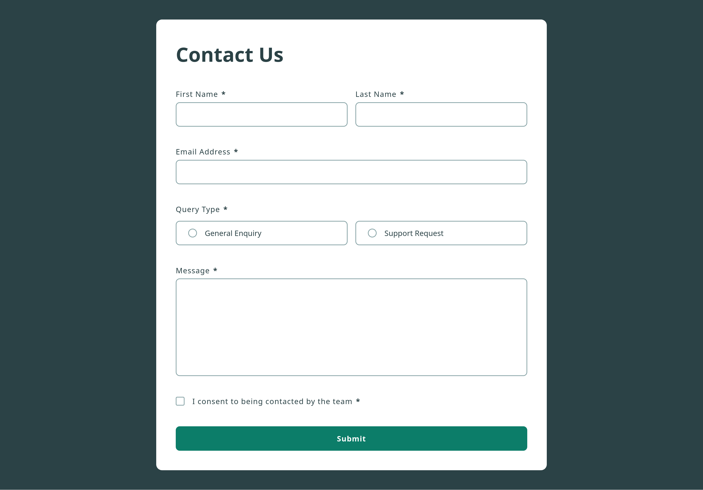

# Frontend Mentor - Contact form solution

This is a solution to the [Contact form challenge on Frontend Mentor](https://www.frontendmentor.io/challenges/contact-form--G-hYlqKJj). Frontend Mentor challenges help you improve your coding skills by building realistic projects.

## Table of contents

- [Overview](#overview)
  - [The challenge](#the-challenge)
  - [Screenshot](#screenshot)
  - [Links](#links)
- [My process](#my-process)
  - [Built with](#built-with)
  - [What I learned](#what-i-learned)
  - [Continued development](#continued-development)
  - [Useful resources](#useful-resources)

**Note: Delete this note and update the table of contents based on what sections you keep.**

## Overview

### The challenge

Users should be able to:

- Complete the form and see a success toast message upon successful submission
- Receive form validation messages if:
  - A required field has been missed
  - The email address is not formatted correctly
- Complete the form only using their keyboard
- Have inputs, error messages, and the success message announced on their screen reader
- View the optimal layout for the interface depending on their device's screen size
- See hover and focus states for all interactive elements on the page

### Screenshot

### Links

- Solution URL: [Contact Form](https://www.frontendmentor.io/solutions/accessible-contact-form-with-success-toast-notification-8fVeIGpGlK)
- Live Site URL: [Contact Form](https://fem-contact-form-iota.vercel.app/)

## My process

### Built with

- Semantic HTML5 markup
- CSS custom properties
- Flexbox
- Mobile-first workflow
- [React](https://reactjs.org/) - JS library
- [Next.js](https://nextjs.org/) - React framework
- [Styled Components](https://styled-components.com/) - For styles
- [Vite](https://vite.dev/guide/) - Build tool

### What I learned

- Learned about aria-attributes, testing accessiblity techniques and polished form validation for different types of form controls.

- Learned about keyboard validation and screen readers best practices for creating accessible user interfaces.

### Continued development

- Learning more about aria-\* attributes and their proper use at required places.

### Useful resources

- [MDN](https://developer.mozilla.org/en-US/docs/Web/Accessibility) - Accessibility guides on mdn.
